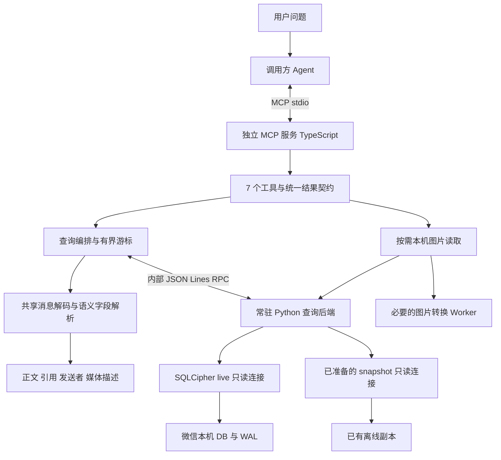

# WeFlow MCP 架构设计

状态：架构已进入实现，运行方式和验证命令见 [使用说明](mcp-usage.md)。日期：2026 年 10 月 3 日。代码基线：`170c4a9`。

需求依据是 [MCP PRD](mcp-prd.md)，实现契约见 [MCP Spec](mcp-spec.md)。本设计确定采用独立 TypeScript MCP 服务、现有常驻 Python 后端和共享的消息解析模块。首版使用 stdio、保留 7 个工具，复用现有只读数据访问；工具提供可追溯材料，分析由调用方 Agent 完成。

## 1 进程与数据链路

一个客户端会话对应一个 MCP 进程和一个 Python 子进程。GUI 使用自己的现有后端连接；两者不共享活动游标和读事务，可以同时只读查询。首版不另起 HTTP 服务，不依赖 GUI 窗口、IPC 或主进程单例。

Python 继续拥有 SQLCipher/SQLite 连接、密钥缓存访问、分库发现、短事务、稳定归并和数据库变化检测。TypeScript 拥有 MCP 协议、工具参数、消息解析、输出预算、查询续读和上下文组装。这样不会在两种语言中各写一套微信数据库解密与查询。

## 2 为什么选择这条路线

| 决策 | 现有依据与理由 |
| --- | --- |
| TypeScript 实现 MCP 层 | 仓库已有 TypeScript；`LocalBackendClient` 仅依赖 Node 模块；基础行解码也有纯函数模块；官方提供 TypeScript SDK |
| 常驻 Python 子进程 | `python/weflow_backend/__main__.py` 已提供持续 JSON Lines RPC、取消和变化事件，复用数据库连接可减少重复启动 |
| 复用解析逻辑但不导入 ChatService 单例 | 基础 mapper 可独立运行，但完整 ChatService/HttpService 依赖 Electron 和配置；只抽取工具确实需要的纯函数 |
| stdio 首发 | 适合本机客户端直接启动服务，无需端口和常驻 GUI；安装用户也应只配置一个命令 |
| 首版没有内置 LLM | 保留原文和确定性统计，让调用方完成任务和关系分析，避免双重模型调用与不可核对摘要 |
| 先有界扫描，再评估索引 | 当前全文搜索是遍历匹配；先把时间、会话和续扫做好，测量后再决定是否建正文索引 |

使用官方 SDK 的稳定版本并固定依赖锁文件。实际协议版本以该 SDK 与目标客户端共同支持的版本协商，首版不要求客户端实现最新规范中的全部扩展。[官方 SDK 目录](https://modelcontextprotocol.io/docs/2026-07-28/sdk)

## 3 模块职责与建议文件

下列路径对应实现模块。紧密相关的小函数可合并，不要求每个概念都变成一个类。

| 位置 | 职责 |
| --- | --- |
| `mcp/server.ts` | 参数解析、启动/关闭、stdio transport、注册工具、取消接入 |
| `mcp/contracts.ts` | 7 个工具 input/output schema、统一消息/coverage/error 类型及默认值 |
| `mcp/tools.ts` | 薄工具处理器：校验参数、调用查询、组装结果 |
| `mcp/query.ts` | 有界读取、过滤/搜索、概览计数、多群归并、上下文窗口和覆盖跟踪 |
| `mcp/cursors.ts` | 内存续读状态、未输出尾部、长文本偏移、结果重放、TTL 与清理 |
| `mcp/runtime.ts` | profile 与账号选择、只读应用锁检查、后端路径发现、连接与版本生命周期 |
| `mcp/media.ts` | 按消息读取本机媒体、缓存密钥读取、输出格式与能力状态 |
| `shared/chat/decode.ts`、`normalize.ts` | 提取基础解码，新增纯正文/引用/@/附件字段归一化；不连接数据库 |
| `electron/services/localBackendClient.ts` | 复用并增加可选请求期限；保留 GUI 现有默认行为 |
| `electron/services/apiMessageMapping.ts` | 保留兼容导出并调用共享 decode；MCP normalize 也调用 decode，避免重复逻辑和循环依赖 |
| `python/weflow_backend/backend.py` | 增加只打开已准备数据、精确消息定位和必要的有界读取接口 |
| `python/weflow_backend/image_keys.py` | 抽取只读缓存读取，避免媒体查询触发进程扫描 |
| `scripts/build-mcp.cjs`、`scripts/mcp.ps1`、`weflow-mcp.cmd` | 独立构建与源码/安装版启动入口 |

查询编排使用现有 `openMessageCursor / fetchMessageBatch` 等接口。发送者与消息类型过滤先在原始批次上执行，正文搜索在归一化后执行；能够安全下推的条件下推 Python，不能为了“下推”改成 raw XML 搜索。

## 4 开始连接的规则

服务首先建立 MCP 协议连接，数据库按第一次查询懒连接。数据未准备时仍能列出工具并通过 `get_status` 返回恢复方法；不因数据库未连接而变成协议无法启动。

配置只在启动参数指定的 profile 中解析。`--data-dir` 优先，否则使用该 profile 保存的选择；没有可唯一确定的选择时返回 `ACCOUNT_REQUIRED`。一个运行实例固定一个账号，业务参数中没有自由切账号入口。

读取模式优先级：显式 `--mode` → 对应账号已保存的模式 → MCP 的新默认 live。最终总是给 Python 传明确 mode，不修改已保存的模式。与现有旧 CLI 的默认 snapshot 区别在文档和配置示例中注明。

应用锁检查读取 profile 的明确锁配置，不尝试解密聊天配置中的秘密，也不把 GUI 解锁状态当作独立进程权限。现有 `isLockMode` 依据 decryptKey、aiModelApiKey、aiModelProfilesJson 的锁前缀判断，不存在一个可直接假定的 lockEnabled 布尔值。该规则位于 `ConfigService` 与 `preparedLaunch`，不是 Python RPC 自带防护，因此 MCP 需要独立接入同一规则。无法判断的配置返回 `PROFILE_CONFIG_INVALID`，不能默认放行。

新增内部 `openPreparedData`，保证 snapshot 缺失时报错，不调用现有 `ensure_snapshot` 的自动创建分支。live 使用已有认证缓存；没有缓存就返回准备动作。媒体查询也只读缓存，不能在缺图片密钥时调用当前 `getImageKeys` 的自动扫描路径。

## 5 统一查询执行方式

定位与状态是轻量查询。阅读、搜索、概览和上下文使用共同的有界批次流程：

1. 固定账号、明确时区和时间范围、当前 connection/revision 或 snapshot 身份。
2. 为每个目标会话创建原始批次游标，最多同时组合 5 个会话。
3. 拉取小批次，执行必要过滤与归一化；搜索匹配正文、引用片段、附件标题等明确字段。
4. 逐条更新覆盖信息和统计，按照输出预算返回结果。
5. 达到字符/条数/执行时间限制时保存续读状态，释放事务。
6. 没有未扫描数据、未输出结果或未完成正文时才结束续读。

多群按稳定消息时间顺序归并，输出每群状态。某群本页没有结果时明确其未扫描、已扫描无匹配或结果在后页，不能将其省略。共享后端按串行 SQL 执行，不为了少量工具创建数据库线程池。

搜索不能直接采用旧 `searchMessages` 作为完整实现，因为当前匹配 raw 内容且全局顺序与续扫覆盖不足。首版通过归一化批次提供正确的正文检索和可恢复扫描。概览尽可能只处理原始时间、方向和类型，不为计数解码所有媒体；有界扫描的部分计数明确标记，后页累计至完成。

## 6 三种标识各司其职

**消息 ID** 可在同账号的进程重启后重新定位。优先使用精确字符串 server ID；没有可靠 server ID 时使用相对分库、表、local ID 和创建时间等明确定位字段。ID 不包含数据库绝对路径，不能复用当前可能含路径或 Number(serverId) 的 UI messageKey。

**分页 cursor** 是短期内存状态，绑定工具、查询参数、账号、数据版本、未输出结果及正文偏移。进程重启或 TTL 到期即失效，工具返回恢复范围。

**业务检查基线** 由调用方保存时间/消息锚点，表示用户上次检查的范围。MCP 查询不自动消费未读或更新基线，也不将普通时间锚点称作可靠变更日志。

## 7 省上下文而保持可恢复

结果默认只有规范化正文、引用、必要媒体说明；发送者和聊天名称映射在一个响应内去重。长文本切段保留 code point 偏移和总长度，游标记录剩余片段，不能截断后跳到下一条。

所有列表/扫描工具返回 `coverage`。扫描完成、结果返回完成和正文完整分别表达。搜索可能扫描结束但还有未输出命中；阅读可能扫描一批但还有未输出尾部；媒体缺口不应被算成正文已解释。

每次 MCP 结果提供一个规范 JSON 文本兼容表示和相同结构的 `structuredContent`；不增加重复的自然语言总结。客户端是否把两者同时交给模型在联调中测量，预算按实际呈现检查，不声称结构化字段免费。[官方工具结果规范](https://modelcontextprotocol.io/specification/2026-07-28/server/tools)

## 8 数据变化和取消

Python 的 live revision 当前是账号级的，任何相关提交可能使原始游标失效。首版遵守此语义，不假定只影响某一个群。

每批次前后核对连接与版本；发生变化时停止本次续读，返回 `CURSOR_STALE` 或 `SOURCE_REPLACED`，带原始范围和重读建议。不要把不同版本的半截结果拼成“完整扫描”。已经输出的消息仍可作为历史证据，但 freshness 说明其读取时点。

MCP 客户端取消直接映射到当前 Python requestId；不能排在同一 SQL 请求之后。工具层执行时间与单次 RPC 超时分开：约 5 秒的工具扫描由多个短 RPC 构成，某次 RPC 本身超时则不能把未知进度当作可恢复扫描点。

EOF、断连与服务退出清理游标、关闭 Python 和媒体 Worker。服务只停止自己创建的进程，不停止微信或另一个 WeFlow GUI。

## 9 本机媒体路径

首版媒体链路为：消息定位 → 提取附件标识 → `hardlink.db` 定位本机附件 → 读取已验证的图片缓存密钥 → 复用纯解密函数 → 必要时 HEIC Worker 转 JPEG → MCP 图片内容块。

当前 `ImageDecryptService` 有 Electron 配置和窗口依赖，不能整类塞进 headless 服务。抽取 V2/旧格式确实需要的纯解密函数；基础图片解密不依赖用户另配 native addon。HEIC 复用现有 Worker 和依赖，资产路径显式注入。

图片输出说明原图/缩略图、是否缩放、尺寸和实际 MIME。截图细字需要清晰图时，Agent 可显式请求原始清晰度；无法在客户端媒体预算内提供时返回 `TOO_LARGE`，不暗中把不可读缩略图当成完整证据。语音转写和文件/OCR 引擎暂不新增；已有可验证文本才返回，缺失说明能力状态。

首版直接返回图片内容块，不依赖客户端读取本机 `file://` 地址。远程资源读取和公网托管均不需要。可用内容与缺失/不支持分别返回，基础消息查询不因媒体不可用而整体失败。

## 10 构建和安装版运行

新增独立构建入口，将 TypeScript MCP 与 JS 依赖构建为 `build/mcp/server.cjs`，相关媒体 Worker/资源一起复制到包内 `resources/mcp`。GUI 原 Vite 入口继续使用原构建，MCP 构建不启动开发服务器。

源码版 `weflow-mcp.cmd` 使用仓库已有 Node/Python 环境；安装版优先复用 WeFlow 包含的 Electron Node 运行能力，以 `ELECTRON_RUN_AS_NODE=1` 启动外置的 `resources/mcp/server.cjs`，再启动现有 `resources/backend/weflow-backend.exe`。启动日志写 stderr，stdout 只属于 MCP transport。

该安装路线必须实测 Windows 标准输入输出继承、`runAsNode` fuse 与媒体依赖解析，不能仅依据 Electron 文档声称已可交付。若包内运行能力不可用，改为包内独立 Node 运行时；用户仍不需要手动安装 Node/Python。不能在源码可用后把安装版留成另一个未经验证的方案。[Electron 环境变量说明](https://www.electronjs.org/docs/latest/api/environment-variables)

## 11 首版实施与验收顺序

| 阶段 | 完成内容 | 可以验收的结果 |
| --- | --- | --- |
| A | stdio 启动、profile 检查、只打开已准备数据、基础纯解析 | GUI 关闭时能定位聊天并读原文，错误可恢复，无暗中 snapshot/密钥扫描 |
| B | 7 工具契约、批次扫描、游标、覆盖、搜索和上下文 | 两个主场景有可引用材料；长文本和多群分页能读完 |
| C | 已缓存本机图片、HEIC 与客户端配置 | 目标客户端能看图，缺失状态准确，原图预算明确 |
| D | 安装包入口、必要回归、性能测量 | 无外置 Node/Python 可运行；耗时与上下文成本有实测记录 |

这里只设计当前需要的模块。持久任务库、向量数据库、长期变更日志、自动通知和额外模型服务不进入首版。以后根据实际问题增加能力。

## 12 阅读依据

已检查的仓库位置：`electron/services/localBackendClient.ts`、`apiMessageMapping.ts`、`httpService.ts`、`imageDecryptService.ts`、`heicDecoder.ts`、`config.ts`、`preparedLaunch.ts`，以及 `python/weflow_backend/backend.py`、`__main__.py`、`image_keys.py` 和 `scripts/package-backend.cjs`。

现有 live 一致性与事件约束见 [live Spec](live-spec.md)，本设计不改写已有 CLI/GUI 行为。“应”“必须”表示架构和验收约束；实际验证范围以使用说明和实现验证记录为准。
